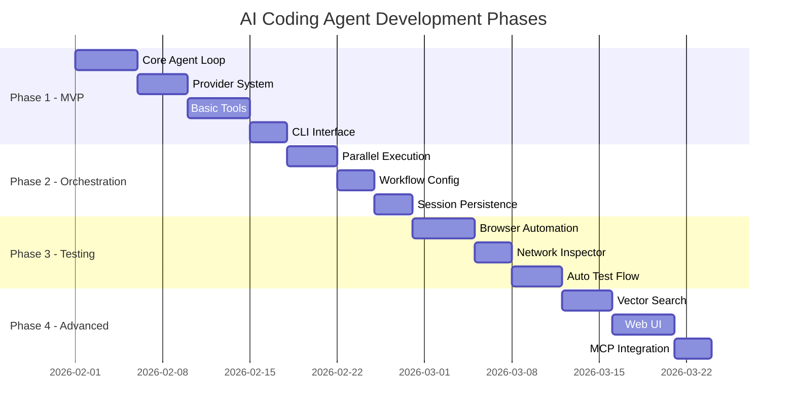
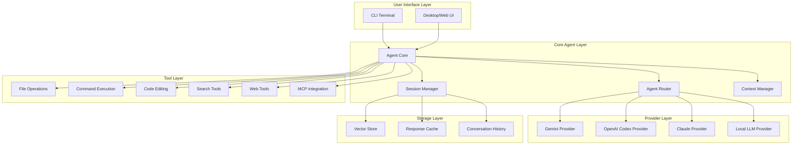
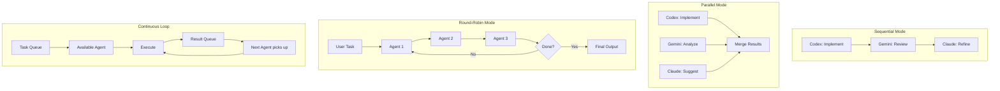
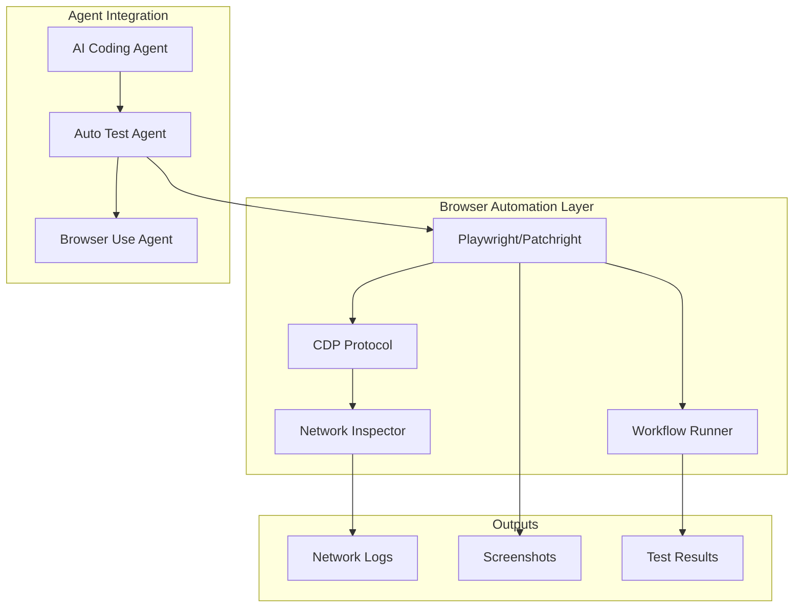
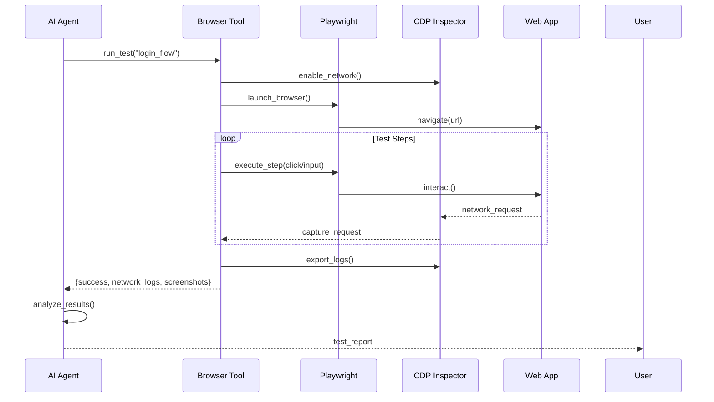

# Kế Hoạch Phát Triển AI Coding Agent

## Tổng Quan

Xây dựng một **AI Coding Agent** hỗ trợ nhiều LLM providers (Gemini, OpenAI Codex, Claude) dựa trên các patterns và best practices từ 5 codebases đã nghiên cứu.

---

## 📋 Danh Sách Tính Năng Đầy Đủ

### 🎯 Core Features

| # | Tính Năng | Mô Tả | Priority |
|---|-----------|-------|----------|
| 1 | **Multi-Provider Support** | Hỗ trợ Gemini, Codex, Claude, Local LLM | P0 |
| 2 | **Agent Loop** | Agentic loop với tool calling | P0 |
| 3 | **Streaming Responses** | Real-time streaming output | P0 |
| 4 | **Context Management** | Quản lý context và conversation history | P0 |
| 5 | **Session Persistence** | Lưu và khôi phục sessions | P1 |
| 6 | **Token Compaction** | Tự động compact history khi vượt limit | P1 |

### 🛠️ Tool Categories

| # | Category | Tools | Priority |
|---|----------|-------|----------|
| 7 | **File Operations** | read_file, write_file, list_dir, search_files, glob | P0 |
| 8 | **Code Editing** | apply_diff, replace_in_file, create_file, delete_file | P0 |
| 9 | **Command Execution** | run_command, run_script, shell_exec | P0 |
| 10 | **Search** | grep, find, ripgrep, semantic_search | P0 |
| 11 | **Git Operations** | git_status, git_diff, git_commit, git_log, git_branch | P1 |
| 12 | **Web Tools** | fetch_url, google_search, browse_page | P1 |
| 13 | **LSP Integration** | go_to_definition, find_references, rename_symbol | P2 |
| 14 | **MCP Integration** | call_mcp_server, list_mcp_tools | P2 |

### 🤖 Provider System

| # | Tính Năng | Mô Tả | Priority |
|---|-----------|-------|----------|
| 15 | **Gemini Provider** | Google Gemini API (free tier available) | P0 |
| 16 | **Codex Provider** | OpenAI Codex via OAuth (ChatGPT Plus) | P0 |
| 17 | **Claude Provider** | Anthropic Claude API | P0 |
| 18 | **Local LLM** | llama.cpp, Ollama integration | P2 |
| 19 | **Provider Router** | Auto-select best provider for task | P1 |
| 20 | **Fallback Chain** | Retry với provider khác khi fail | P1 |
| 21 | **Rate Limiting** | Handle API rate limits gracefully | P1 |

### 🔄 Agent Orchestration

| # | Tính Năng | Mô Tả | Priority |
|---|-----------|-------|----------|
| 22 | **Sequential Workflow** | Agents chạy tuần tự (Codex → Gemini → Claude) | P0 |
| 23 | **Parallel Execution** | Nhiều agents chạy đồng thời | P1 |
| 24 | **Round-Robin Mode** | Agents thay phiên refine liên tục | P1 |
| 25 | **Continuous Loop** | Pipeline liên tục với task queue | P1 |
| 26 | **Workflow YAML Config** | Định nghĩa workflow bằng YAML | P1 |
| 27 | **Stop Conditions** | Tự động dừng khi đạt điều kiện | P1 |
| 28 | **Agent Roles** | Chuyên môn hóa: implement, review, refine | P0 |

### 🧪 Browser Automation & Testing

| # | Tính Năng | Mô Tả | Priority |
|---|-----------|-------|----------|
| 29 | **Playwright Integration** | Browser automation | P1 |
| 30 | **CDP Network Inspector** | Capture API traffic | P1 |
| 31 | **Workflow Runner** | YAML-based test workflows | P1 |
| 32 | **Screenshot Capture** | Auto screenshot on errors | P2 |
| 33 | **Cookie Management** | Inject/export cookies | P2 |
| 34 | **Auto Test & Fix** | Test → Analyze → Fix loop | P2 |

### 💻 User Interface

| # | Tính Năng | Mô Tả | Priority |
|---|-----------|-------|----------|
| 35 | **CLI Interface** | Terminal REPL (Click + Rich) | P0 |
| 36 | **Readline Support** | History, arrow keys, tab complete | P0 |
| 37 | **Colored Output** | Syntax highlighting, rich formatting | P0 |
| 38 | **Progress Indicators** | Spinners, progress bars | P1 |
| 39 | **Web UI** | Flask/FastAPI + Vue/React frontend | P2 |
| 40 | **Desktop App** | Electron wrapper | P3 |

### 💾 Storage & Caching

| # | Tính Năng | Mô Tả | Priority |
|---|-----------|-------|----------|
| 41 | **Response Cache** | Cache LLM responses | P1 |
| 42 | **Vector Store** | Semantic search cho codebase | P2 |
| 43 | **Session Storage** | Persist conversations to disk | P1 |
| 44 | **Config Management** | YAML/JSON config files | P0 |

### 🔒 Security & Reliability

| # | Tính Năng | Mô Tả | Priority |
|---|-----------|-------|----------|
| 45 | **Input Validation** | Sanitize user inputs | P0 |
| 46 | **Command Confirmation** | Ask before dangerous commands | P0 |
| 47 | **API Key Management** | Secure key storage | P0 |
| 48 | **Retry Logic** | Exponential backoff on failures | P1 |
| 49 | **Audit Logging** | Log all actions for debugging | P1 |
| 50 | **Sandbox Execution** | Safe command execution | P2 |

---

## 🎯 MVP Features (Phase 1)

> [!IMPORTANT]
> **MVP bao gồm 20 tính năng P0:**

```
✅ Multi-Provider (Gemini, Codex, Claude)
✅ Agent Loop với tool calling
✅ Streaming responses
✅ Context management
✅ File operations (read/write/list/search)
✅ Code editing (diff/replace)
✅ Command execution
✅ Search tools (grep/find)
✅ Sequential workflow
✅ Agent roles (implement/review/refine)
✅ CLI Interface
✅ Readline support
✅ Colored output
✅ Config management
✅ Input validation
✅ Command confirmation
✅ API key management
```

---

## 📊 Implementation Phases



---

## Phân Tích Các Codebases Tham Khảo

### 1. AI-Agents-Orchestrator (Python)

| Aspect | Chi Tiết |
|--------|----------|
| **Ngôn ngữ** | Python 3.8+ |
| **Kiến trúc** | Multi-agent orchestration với workflow engine |
| **LLMs** | Claude, Codex, Gemini, Copilot |
| **Interface** | CLI (Click + Rich) + Web UI (Vue 3 + Flask) |
| **Key Patterns** | Adapter Pattern, Workflow Engine, Retry Logic, Caching |

**Điểm mạnh tham khảo:**
- `BaseAdapter` abstract class với interface chuẩn
- `AgentResponse` dataclass cho responses
- `CLICommunicator` cho CLI tool communication
- Workflow engine với sequential/parallel/iterative execution
- Prometheus metrics và structured logging

---

### 2. adk-code (Go)

| Aspect | Chi Tiết |
|--------|----------|
| **Ngôn ngữ** | Go 1.24+ |
| **Framework** | Google ADK (Agent Development Kit) |
| **LLMs** | Gemini, OpenAI, Vertex AI |
| **Interface** | Terminal REPL với rich UI |
| **Key Features** | 30+ tools, MCP integration, Session persistence |

**Điểm mạnh tham khảo:**
- Tool registry pattern (`tools/registry.go`)
- 12 tool categories: file, web, search, exec, edit, display, discovery, agents, websearch, workspace
- Dynamic sub-agent architecture
- Session compaction với token-aware management
- MCP (Model Context Protocol) integration

---

### 3. litellm-codex-oauth-provider (Python)

| Aspect | Chi Tiết |
|--------|----------|
| **Ngôn ngữ** | Python |
| **Mục đích** | OAuth bridge cho Codex CLI tokens |
| **Integration** | LiteLLM proxy |
| **Components** | adapter, auth, provider, http_client, sse_utils |

**Điểm mạnh tham khảo:**
- OAuth token management từ Codex CLI
- Custom LiteLLM provider pattern
- SSE/streaming utilities
- Model mapping và routing

---

### 4. local-cocoa (Electron + Python)

| Aspect | Chi Tiết |
|--------|----------|
| **Frontend** | Electron + React + TypeScript + TailwindCSS |
| **Backend** | FastAPI + llama.cpp + Qdrant |
| **Features** | Local RAG, Vector search, OCR/VLM |
| **Privacy** | 100% local execution |

**Điểm mạnh tham khảo:**
- Services architecture: chunker, indexer, parser, memory, search
- Local model integration (llama.cpp, whisper.cpp)
- Vector-powered semantic search (Qdrant)
- Multi-modal memory (documents, images, audio, video)

---

### 5. opencode (TypeScript)

| Aspect | Chi Tiết |
|--------|----------|
| **Ngôn ngữ** | TypeScript |
| **Packages** | app, console, desktop, sdk, ui, plugin, web |
| **Interface** | TUI + Desktop app + Web |
| **Key Features** | Provider-agnostic, LSP support, Client/server architecture |

**Điểm mạnh tham khảo:**
- Monorepo structure với 16 packages
- Provider-agnostic design
- Built-in agents: build (full access), plan (read-only)
- LSP integration out of the box
- Client/server architecture cho remote control

---

## Đề Xuất Kiến Trúc AI Coding Agent

### Architecture Diagram



---

## Proposed Components

### 1. Provider System (Tham khảo: AI-Agents-Orchestrator + litellm-codex-oauth-provider)

```python
# providers/base.py
from abc import ABC, abstractmethod
from dataclasses import dataclass
from typing import AsyncIterator, Dict, Any, List

@dataclass
class Message:
    role: str  # "user", "assistant", "system", "tool"
    content: str
    tool_calls: List[Dict] = None

@dataclass
class CompletionResponse:
    content: str
    tool_calls: List[Dict]
    usage: Dict[str, int]
    model: str
    finish_reason: str

class BaseProvider(ABC):
    """Base class cho tất cả LLM providers."""
    
    @abstractmethod
    async def complete(
        self, 
        messages: List[Message],
        tools: List[Dict] = None,
        **kwargs
    ) -> CompletionResponse:
        """Generate completion từ messages."""
        pass
    
    @abstractmethod
    async def stream(
        self,
        messages: List[Message],
        tools: List[Dict] = None,
        **kwargs
    ) -> AsyncIterator[str]:
        """Stream completion response."""
        pass
    
    @abstractmethod
    def is_available(self) -> bool:
        """Check if provider is available."""
        pass
```

### 2. Tool System (Tham khảo: adk-code + opencode)

```python
# tools/base.py
from dataclasses import dataclass
from typing import Any, Dict, Callable

@dataclass
class ToolDefinition:
    name: str
    description: str
    parameters: Dict[str, Any]  # JSON Schema
    handler: Callable
    category: str  # file, exec, edit, search, web
    requires_confirmation: bool = False

class ToolRegistry:
    """Central registry for all tools."""
    
    def __init__(self):
        self._tools: Dict[str, ToolDefinition] = {}
    
    def register(self, tool: ToolDefinition):
        self._tools[tool.name] = tool
    
    def get(self, name: str) -> ToolDefinition:
        return self._tools.get(name)
    
    def list_tools(self, category: str = None) -> List[ToolDefinition]:
        if category:
            return [t for t in self._tools.values() if t.category == category]
        return list(self._tools.values())
    
    def to_openai_format(self) -> List[Dict]:
        """Convert tools to OpenAI function calling format."""
        return [
            {
                "type": "function",
                "function": {
                    "name": tool.name,
                    "description": tool.description,
                    "parameters": tool.parameters
                }
            }
            for tool in self._tools.values()
        ]
```

### 3. Core Agent (Tham khảo: AI-Agents-Orchestrator + adk-code)

```python
# agent/core.py
class CodingAgent:
    """Main AI coding agent."""
    
    def __init__(
        self,
        provider: BaseProvider,
        tools: ToolRegistry,
        session_manager: SessionManager,
        config: AgentConfig
    ):
        self.provider = provider
        self.tools = tools
        self.session = session_manager
        self.config = config
    
    async def run(self, user_input: str) -> str:
        """Execute agent loop."""
        messages = self.session.get_messages()
        messages.append(Message(role="user", content=user_input))
        
        while True:
            # Get completion from LLM
            response = await self.provider.complete(
                messages=messages,
                tools=self.tools.to_openai_format()
            )
            
            if response.finish_reason == "stop":
                # No more tool calls, return final response
                self.session.add_message(Message(
                    role="assistant",
                    content=response.content
                ))
                return response.content
            
            if response.tool_calls:
                # Execute tool calls
                for tool_call in response.tool_calls:
                    result = await self._execute_tool(tool_call)
                    messages.append(Message(
                        role="tool",
                        content=result,
                        tool_call_id=tool_call["id"]
                    ))
            
            messages.append(Message(
                role="assistant",
                content=response.content,
                tool_calls=response.tool_calls
            ))
    
    async def _execute_tool(self, tool_call: Dict) -> str:
        """Execute a tool call."""
        tool = self.tools.get(tool_call["function"]["name"])
        if not tool:
            return f"Error: Unknown tool {tool_call['function']['name']}"
        
        try:
            args = json.loads(tool_call["function"]["arguments"])
            result = await tool.handler(**args)
            return json.dumps(result)
        except Exception as e:
            return f"Error executing tool: {str(e)}"
```

### 4. Session Management (Tham khảo: adk-code)

```python
# session/manager.py
class SessionManager:
    """Manage conversation sessions with token-aware compaction."""
    
    def __init__(self, max_tokens: int = 128000):
        self.max_tokens = max_tokens
        self.messages: List[Message] = []
        self.system_prompt: str = ""
    
    def add_message(self, message: Message):
        self.messages.append(message)
        self._compact_if_needed()
    
    def get_messages(self) -> List[Message]:
        return [Message(role="system", content=self.system_prompt)] + self.messages
    
    def _compact_if_needed(self):
        """Compact history if exceeding token limit."""
        current_tokens = self._count_tokens()
        if current_tokens > self.max_tokens * 0.8:
            # Keep system prompt, summarize old messages
            self._summarize_old_messages()
    
    def _summarize_old_messages(self):
        """Summarize older messages to reduce token count."""
        # Implementation: Keep recent N messages, summarize the rest
        pass
```

---

## Proposed Tool Categories

| Category | Tools | Source Reference |
|----------|-------|------------------|
| **File** | read_file, write_file, list_dir, search_files | adk-code |
| **Edit** | apply_diff, replace_in_file, create_file | adk-code, opencode |
| **Exec** | run_command, run_script | adk-code |
| **Search** | grep, find, semantic_search | adk-code, local-cocoa |
| **Web** | fetch_url, google_search | adk-code |
| **Git** | git_status, git_diff, git_commit | opencode |
| **LSP** | go_to_definition, find_references | opencode |
| **MCP** | mcp_call | adk-code |

---

## Proposed Tech Stack Options

### Option A: Python-based (Recommended for flexibility)

| Component | Technology |
|-----------|------------|
| Core | Python 3.11+ |
| CLI | Click + Rich |
| Async | asyncio + aiohttp |
| Providers | litellm (unified interface) |
| Vector DB | Qdrant / ChromaDB |
| GUI | Gradio / Streamlit |

### Option B: TypeScript-based (For TUI focus)

| Component | Technology |
|-----------|------------|
| Core | TypeScript + Node.js |
| CLI | Ink (React for CLI) |
| Providers | openai-node, @anthropic-ai/sdk |
| Build | Bun / Vite |
| Desktop | Electron |

### Option C: Go-based (For performance)

| Component | Technology |
|-----------|------------|
| Core | Go 1.24+ |
| Framework | Google ADK |
| CLI | Charm (bubbletea, lipgloss) |
| Providers | genai-go |

---

## User Review Required

> [!IMPORTANT]
> Vui lòng review các điểm sau trước khi tôi tiến hành xây dựng:

1. **Ngôn ngữ lập trình**: Python, TypeScript, hay Go?
2. **Focus**: CLI-first, GUI-first, hay cả hai?
3. **LLM Providers ưu tiên**: Sắp xếp thứ tự ưu tiên Gemini/Codex/Claude?
4. **Local LLM support**: Có cần hỗ trợ local models (llama.cpp) không?
5. **RAG/Vector search**: Có cần semantic search cho codebase không?
6. **MCP integration**: Có cần hỗ trợ Model Context Protocol không?
7. **Scope**: MVP minimal hay full-featured như các projects tham khảo?

---

## Parallel/Continuous Agent Orchestration (Tham khảo: AI-Agents-Orchestrator)

### Execution Modes



### 1. AsyncExecutor Pattern

```python
# orchestrator/async_executor.py
import asyncio
from concurrent.futures import ThreadPoolExecutor
from typing import List, Dict, Any, Callable

class AsyncOrchestrator:
    """Execute agents in parallel/sequential/round-robin modes."""
    
    def __init__(self, agents: Dict[str, BaseProvider], max_workers: int = 3):
        self.agents = agents
        self.executor = ThreadPoolExecutor(max_workers=max_workers)
        self.task_queue = asyncio.Queue()
        self.result_queue = asyncio.Queue()
    
    async def execute_parallel(
        self, 
        task: str, 
        agent_names: List[str]
    ) -> List[Dict[str, Any]]:
        """Run multiple agents in parallel on same task."""
        async def run_agent(name: str):
            agent = self.agents[name]
            result = await agent.complete(task)
            return {"agent": name, "result": result}
        
        tasks = [run_agent(name) for name in agent_names]
        results = await asyncio.gather(*tasks, return_exceptions=True)
        return results
    
    async def execute_round_robin(
        self,
        task: str,
        agent_order: List[str],
        max_rounds: int = 3
    ) -> Dict[str, Any]:
        """Round-robin: Agents take turns refining the task."""
        context = {"task": task, "history": []}
        
        for round_num in range(max_rounds):
            for agent_name in agent_order:
                agent = self.agents[agent_name]
                
                # Build prompt with previous context
                prompt = self._build_round_robin_prompt(context, agent_name, round_num)
                result = await agent.complete(prompt)
                
                context["history"].append({
                    "round": round_num,
                    "agent": agent_name,
                    "output": result.content
                })
                context["previous_output"] = result.content
                
                # Check if task is complete
                if self._should_stop(result):
                    return {"final": result.content, "history": context["history"]}
        
        return {"final": context["previous_output"], "history": context["history"]}
    
    async def execute_continuous_loop(
        self,
        initial_task: str,
        agent_roles: Dict[str, str],  # {"codex": "implement", "gemini": "review", "claude": "refine"}
        stop_condition: Callable[[Dict], bool]
    ):
        """Continuous loop: Agents work continuously, passing results to each other."""
        # Producer: Add initial task
        await self.task_queue.put({
            "task": initial_task,
            "next_role": "implement",
            "iteration": 0
        })
        
        # Start worker tasks for each agent
        workers = []
        for agent_name, role in agent_roles.items():
            worker = asyncio.create_task(
                self._agent_worker(agent_name, role)
            )
            workers.append(worker)
        
        # Monitor results
        while True:
            result = await self.result_queue.get()
            if stop_condition(result):
                # Cancel all workers
                for w in workers:
                    w.cancel()
                return result
    
    async def _agent_worker(self, agent_name: str, role: str):
        """Worker coroutine for continuous agent execution."""
        agent = self.agents[agent_name]
        
        while True:
            # Get task matching this agent's role
            task_item = await self.task_queue.get()
            
            if task_item["next_role"] != role:
                # Not for this agent, put back
                await self.task_queue.put(task_item)
                await asyncio.sleep(0.1)
                continue
            
            # Execute task
            result = await agent.complete(task_item["task"])
            
            # Determine next role
            next_role = self._get_next_role(role)
            
            # Put result in queue
            await self.result_queue.put({
                "agent": agent_name,
                "role": role,
                "output": result.content,
                "iteration": task_item["iteration"]
            })
            
            # Create next task
            if next_role:
                await self.task_queue.put({
                    "task": result.content,
                    "previous_output": result.content,
                    "next_role": next_role,
                    "iteration": task_item["iteration"] + 1
                })
```

### 2. Workflow Configuration

```yaml
# config/workflows.yaml
workflows:
  # Round-robin: Agents thay phiên nhau
  round_robin:
    mode: "round_robin"
    max_rounds: 5
    agents:
      - name: codex
        role: implement
        prompt_template: |
          Implement the following task: {task}
          Previous feedback: {feedback}
      
      - name: gemini  
        role: review
        prompt_template: |
          Review this implementation for issues:
          {previous_output}
          
      - name: claude
        role: refine
        prompt_template: |
          Refine based on review feedback:
          Implementation: {implementation}
          Review: {review_feedback}
    
    stop_conditions:
      - type: "no_suggestions"
        threshold: 2  # Stop if review has <2 suggestions
      - type: "max_iterations"
        value: 5
  
  # Parallel: Tất cả agents chạy đồng thời
  parallel_review:
    mode: "parallel"
    agents:
      - name: gemini
        role: security_review
      - name: claude  
        role: performance_review
      - name: codex
        role: style_review
    
    merge_strategy: "combine_all"  # or "vote", "best_score"
  
  # Continuous: Agents chạy liên tục như pipeline
  continuous_pipeline:
    mode: "continuous"
    agents:
      codex:
        role: implement
        next: gemini
      gemini:
        role: review
        next: claude
      claude:
        role: refine
        next: codex  # Loop back
    
    stop_conditions:
      - type: "approval"
        agent: gemini
        keyword: "APPROVED"
      - type: "max_iterations"
        value: 10
```

### 3. Agent Roles & Specialization

| Agent | Role | Khi nào sử dụng |
|-------|------|-----------------|
| **Codex** | Implementation | Viết code mới, generate boilerplate |
| **Gemini** | Review & Analysis | Code review, tìm bugs, security scan |
| **Claude** | Refinement & Docs | Refactor, viết docs, explain code |
| **Local LLM** | Quick tasks | Formatting, simple completions |

### 4. Kết Hợp Modes

```python
# Ví dụ: Parallel review + Sequential refine
async def complex_workflow(task: str):
    orchestrator = AsyncOrchestrator(agents)
    
    # Step 1: Codex implements
    impl = await orchestrator.agents["codex"].complete(f"Implement: {task}")
    
    # Step 2: Parallel reviews
    reviews = await orchestrator.execute_parallel(
        f"Review this code:\n{impl.content}",
        agent_names=["gemini", "claude"]
    )
    
    # Step 3: Merge reviews
    combined_feedback = merge_reviews(reviews)
    
    # Step 4: Round-robin refinement
    final = await orchestrator.execute_round_robin(
        f"Refine based on feedback:\n{impl.content}\n\nFeedback:\n{combined_feedback}",
        agent_order=["codex", "gemini"],
        max_rounds=2
    )
    
    return final
```

---

## Browser Automation & Auto Testing (Tham khảo: browser_use)

### Architecture Overview



### 1. CDP Network Inspector

```python
# tools/browser/network_inspector.py
from dataclasses import dataclass, field
import websocket
import json
from typing import Dict, List, Optional, Callable

@dataclass
class NetworkRequest:
    """Captured network request/response."""
    request_id: str
    timestamp: str
    method: str
    url: str
    request_headers: Dict[str, str] = field(default_factory=dict)
    post_data: Optional[str] = None
    status_code: Optional[int] = None
    response_headers: Dict[str, str] = field(default_factory=dict)
    response_body: Optional[str] = None
    response_time_ms: float = 0

class CDPNetworkInspector:
    """Capture network traffic via Chrome DevTools Protocol."""
    
    def __init__(self, cdp_port: int = 9222, url_filter: str = None):
        self.cdp_port = cdp_port
        self.url_filter = url_filter
        self.requests: Dict[str, NetworkRequest] = {}
        self.completed: List[NetworkRequest] = []
        self.ws = None
    
    def connect(self) -> bool:
        """Connect to Chrome via CDP WebSocket."""
        import httpx
        pages = httpx.get(f"http://127.0.0.1:{self.cdp_port}/json").json()
        ws_url = pages[0].get("webSocketDebuggerUrl")
        self.ws = websocket.create_connection(ws_url)
        return True
    
    def enable_network(self):
        """Enable Network domain monitoring."""
        self._send("Network.enable")
        self._send("Network.setCacheDisabled", {"cacheDisabled": True})
    
    def _send(self, method: str, params: dict = None):
        self.ws.send(json.dumps({"id": 1, "method": method, "params": params or {}}))
    
    def export_har(self, output_path: str):
        """Export captured requests to HAR format."""
        # Convert to HAR format for analysis
        pass
```

### 2. Workflow Runner (YAML-based)

```yaml
# workflows/test_api_endpoint.workflow.yaml
name: "Test API Endpoint"
description: "Auto test workflow cho API testing"

inputs:
  - name: base_url
    required: true
  - name: auth_token
    required: false

steps:
  - id: navigate_to_app
    type: navigation
    url: "{{base_url}}"
    wait_ms: 2000
  
  - id: login_if_needed
    type: click
    target_text: "Đăng nhập"
    optional: true
    fallback_selectors:
      - "button.login-btn"
      - "#login-button"
  
  - id: open_api_page
    type: click
    target_text: "API Settings"
    wait_ms: 1500
  
  - id: capture_network
    type: network_capture
    duration_seconds: 30
    filter: "api|graphql"
    export_path: "./logs/api_capture.json"
  
  - id: verify_response
    type: assert
    condition: "response.status_code == 200"
    error_message: "API returned non-200 status"
```

### 3. Integration với AI Agent

```python
# agent/browser_tool.py
from tools.browser.network_inspector import CDPNetworkInspector
from tools.browser.workflow_runner import WorkflowRunner

class BrowserTestTool:
    """Tool cho AI Agent để thực hiện browser automation và testing."""
    
    async def run_workflow(
        self, 
        workflow_name: str,
        variables: dict = None,
        capture_network: bool = True
    ) -> dict:
        """Chạy workflow YAML và capture network."""
        
        # Start network inspector
        inspector = None
        if capture_network:
            inspector = CDPNetworkInspector(cdp_port=9222)
            inspector.connect()
            inspector.enable_network()
        
        # Run workflow
        runner = WorkflowRunner(
            workflow_path=f"workflows/{workflow_name}.yaml",
            variables=variables or {}
        )
        result = await runner.run()
        
        # Get network logs
        if inspector:
            network_logs = inspector.completed
            inspector.stop()
        
        return {
            "success": result.success,
            "steps_completed": result.steps_completed,
            "network_requests": len(network_logs) if inspector else 0,
            "api_calls": [r for r in network_logs if "/api/" in r.url]
        }
    
    async def capture_api_traffic(
        self,
        url: str,
        duration_seconds: int = 60,
        filter_pattern: str = None
    ) -> List[NetworkRequest]:
        """Capture API traffic khi browse webpage."""
        inspector = CDPNetworkInspector(url_filter=filter_pattern)
        inspector.connect()
        inspector.enable_network()
        
        async with async_playwright() as p:
            browser = await p.chromium.launch(
                args=[f"--remote-debugging-port=9222"]
            )
            page = await browser.new_page()
            await page.goto(url)
            await asyncio.sleep(duration_seconds)
        
        return inspector.completed

# Register as tool
browser_test_tool = ToolDefinition(
    name="browser_test",
    description="Run browser automation workflows and capture network traffic",
    category="testing",
    handler=BrowserTestTool().run_workflow,
    parameters={
        "type": "object",
        "properties": {
            "workflow_name": {"type": "string"},
            "variables": {"type": "object"},
            "capture_network": {"type": "boolean", "default": True}
        }
    }
)
```

### 4. Auto Testing Flow



### 5. Kết Hợp Browser Testing với Agent Orchestration

```python
# Ví dụ: AI Agent tự động test và fix bugs
async def auto_test_and_fix(code_change: str):
    orchestrator = AsyncOrchestrator(agents)
    
    # Step 1: Codex implements the change
    impl = await orchestrator.agents["codex"].complete(code_change)
    
    # Step 2: Browser agent runs tests
    browser_tool = BrowserTestTool()
    test_result = await browser_tool.run_workflow(
        workflow_name="integration_test",
        capture_network=True
    )
    
    if not test_result["success"]:
        # Step 3: Gemini analyzes test failures + network logs
        analysis = await orchestrator.agents["gemini"].complete(f"""
            Analyze test failure:
            Steps completed: {test_result['steps_completed']}
            API calls captured: {test_result['api_calls']}
            
            Find the bug and suggest fix.
        """)
        
        # Step 4: Claude fixes the bug
        fix = await orchestrator.agents["claude"].complete(f"""
            Apply fix based on analysis:
            {analysis.content}
        """)
        
        # Step 5: Re-run tests
        test_result = await browser_tool.run_workflow("integration_test")
    
    return test_result
```

---

## Verification Plan

### Automated Tests
- Unit tests cho mỗi provider
- Integration tests cho tool execution
- End-to-end tests cho agent loop

### Manual Verification
- Test với các prompts coding thực tế
- Verify tool execution trên real files
- Test streaming responses
